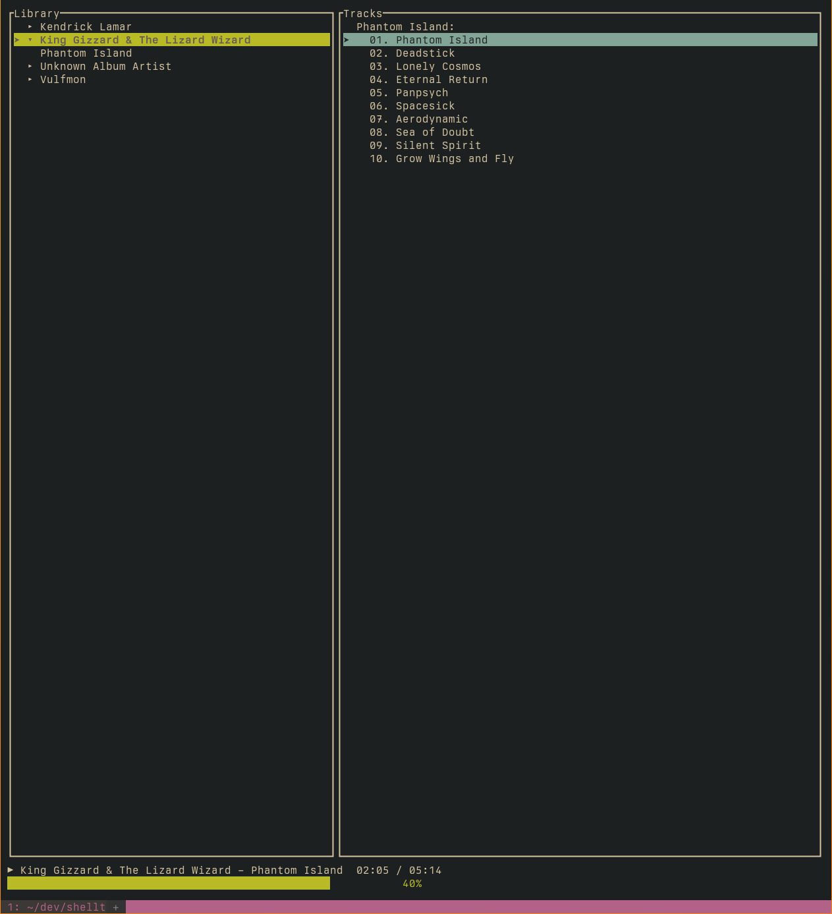
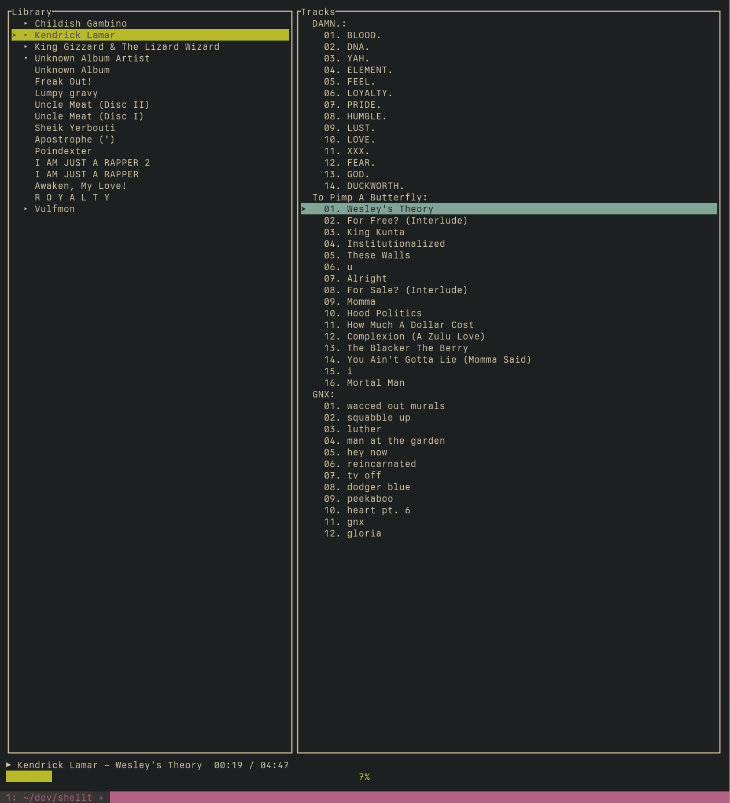
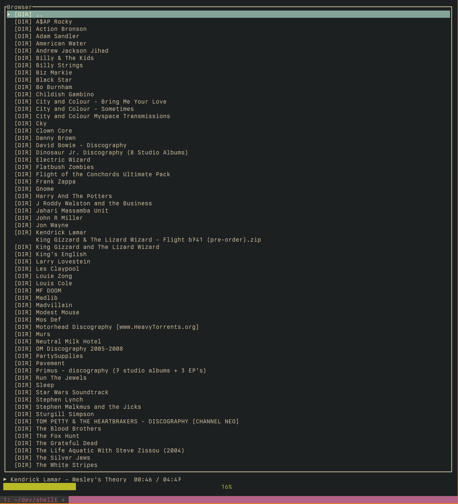

# TUI Music Player (Rust)

A terminal-based music player written in Rust using
[ratatui](https://github.com/ratatui-org/ratatui) and
[crossterm](https://github.com/crossterm-rs/crossterm).

Navigate your filesystem, browse audio files, and play music — all in the
terminal.

## Features

- TUI interface with multiple screens
  - Library view
  - File browser
  - Playlist (coming soon)
- Navigate directories using keyboard
- Dotfiles are hidden by default
- Modular, extensible codebase
- Persistent library

## Screenshots

<details>
<summary>
Library Screenshot 1
</summary>

</details>

<details>
<summary>
Library Screenshot 2
</summary>

</details>

<details>
<summary>
Browser Screenshot 1
</summary>

</details>

## Installation

```bash
git clone git@github.com:ducks/shelltrax.git
cd shelltrax
cargo run
```

## Keybindings

| Key           | Action                          |
|---------------|---------------------------------|
| `1`           | Go to Library                   |
| `5`           | Go to Browser                   |


### Browser View

| Key           | Action                          |
|---------------|---------------------------------|
| `a`           | Add file/dir to playlist        |

### Library View

| Key           | Action                          |
|---------------|---------------------------------|
| `Tab`         | Toggle focus left/right         |
| `Enter`       | Play selected track             |
| `c`           | Toggle pause/resume             |
| `n`           | Next song                       |
| `p`           | Toggle autoplay                 |
| `Backspace`   | Go up a directory (Browser)     |
| `Space`       | Toggle artist/album view        |
| `Up/Down`     | Navigate lists                  |

## Planned Features / TODO

- [x] Hide dotfiles
- [x] Prevent duplication
- [x] Library persistence
- [x] Audio playback via `rodio`
- [x] Autoplay
- [ ] Sort directories before files
- [ ] Playlist screen with queue
- [ ] Footer bar with help / now playing
- [ ] Config file for keybindings and paths
- [ ] Save/restore last visited directory
- [ ] Match more `cmus` keybindings and behaviors (e.g. `Tab`, `v`, `:`)

